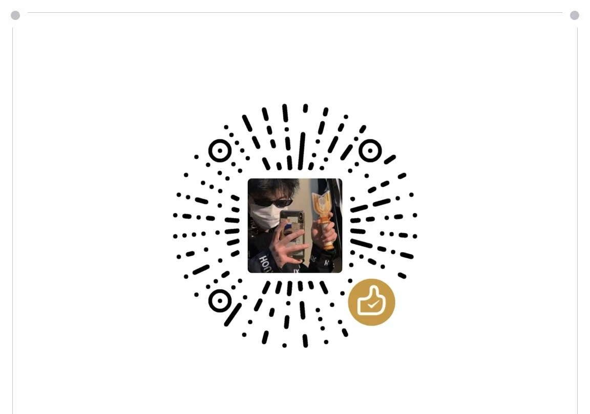

# Antigravity 汉化补丁 (Elite Edition)


本补丁专为 **Google Antigravity** 打造，提供完善的中文界面支持。通过底层代码注入，不仅汉化了标准菜单和设置，还解决了部分动态弹窗的汉化问题。

---

## ✨ 核心特性

1. **界面全覆盖汉化**
   - 汉化所有主界面、侧边栏、工具栏及隐藏的深层设置菜单（包括通用、快捷键、主题、网络等）。
2. **动态权限弹窗汉化**
   - 解决了 Antigravity 聊天流内动态生成的权限弹窗无法被翻译的问题。
   - 内置定时匹配机制，自动识别并翻译诸如 `allow this time`、`and always allow` 等英文权限请求选项，且不会影响用户正常的中文对话与代码输出。
3. **轻量级非侵入设计**
   - 脚本通过静默替换 `preload.js` 与字典文件实现，极低系统开销，无需常驻后台程序。
4. **一键智能安装**
   - 告别繁琐的手动替换文件。内附 Windows 与 macOS 双平台的“一键安装脚本”，双击或运行即可全自动检测路径、备份原文件并执行替换。

---

## 🚀 安装与使用方法

### 第一步：下载补丁包
在 [Releases](../../releases) 页面下载最新版本的压缩包，并将其解压到任意文件夹。本仓库提供独立的 `Windows` 和 `Mac` 文件夹，请根据您的系统选择进入对应的文件夹。

### 第二步：一键执行安装

**对于 Windows 用户：**
1. 进入解压后的 `Windows` 文件夹。
2. 找到并双击运行 **`安装汉化补丁.bat`** 文件。
3. 脚本会自动申请管理员权限。在弹出的绿色命令行窗口中，输入数字 **`1`**（表示执行安装覆盖）。
4. 看到“替换成功”的提示后，按任意键退出。

**对于 macOS 用户：**
1. 打开终端（Terminal），进入解压后的 `Mac` 文件夹。
2. 为脚本添加执行权限并运行：
   ```bash
   chmod +x 安装汉化补丁_Mac.sh
   ./安装汉化补丁_Mac.sh
   ```
3. 看到“安装完成”的提示即可。

### 第三步：重启 Antigravity
如果您的 Antigravity 软件当前正在运行，请**彻底关闭并重新打开**软件。
重启后即可体验全中文界面。

> **⚠️ 注意事项**：
> 如果后续 Antigravity 进行了官方大版本更新，汉化可能会部分失效。如果遇到界面排版错乱，可以重新运行对应系统的卸载脚本恢复原版。

---

## ☕ 赞赏与支持

如果您觉得这个补丁对您有帮助，欢迎请开发者喝杯咖啡！您的支持是我持续更新的动力。



---

## 🛠️ 常见问题

**Q1：安装时提示找不到路径怎么办？**
A1：脚本默认会寻找软件的标准安装目录：
- **Windows**: `C:\Users\用户名\AppData\Local\Programs\antigravity\resources\app`
- **macOS**: `/Applications/Antigravity.app/Contents/Resources/app`

如果您的软件安装在其他自定义盘符或目录，请手动将您对应系统文件夹内的 `dist` 目录下的 `preload.js` 和 `dict.json` 复制替换到您的实际安装目录下。

**Q2：终端里弹出的允许命令执行的按钮为什么有时候还是英文？**
A2：请确保您安装的是 **v3.3.0 或以上版本**。新版本已通过动态匹配彻底修复此问题，并增加对登录报错页面的完全汉化支持。

---

## 📅 更新日志

- **v3.3.0 (2026-07-20)**
  - 项目结构重构：拆分 Windows 与 Mac 独立版本文件夹，各自包含独立的 `dist` 翻译核心包，开箱即用，无需繁琐设置。
  - 新增 macOS 专属安装与卸载脚本。
  - 补充对“账号登录”及“网络报错”界面中文词条的支持。
- **v3.2.0**
  - 修复终端权限确认弹窗（因混入聊天流中）被错误屏蔽翻译的问题，增加动态文本匹配。
- **v3.1.9**
  - 增加对动态生成文本（包含特定终端命令的选项语句）的正则匹配与截断翻译。

---
*本项目仅供交流学习使用，Antigravity 商标及著作权归原公司所有。*
